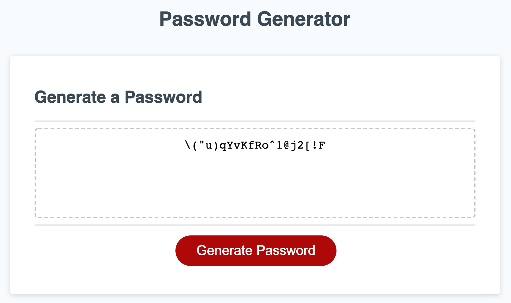

# password-generator-tool
## Description
The website is a basic random password generation tool using javascript.
The password generated will always include all criteria user selects.

## User Story
```
As an employee with access to sensitive data, I want to randomly generate a password that meets certain criteria so that I can create a strong password that provides greater security.
```

## Deployed web visual



## Features
The following are the features that were implemented:
* Generate Password button that initiates the process.
* Series of prompts that asks the user for the password criteria.
* Outputs a randomized password based on the user selected criteria.

## Link
https://andrewyoo93.github.io/password-generator-tool/

## License
[](./LICENSE)
